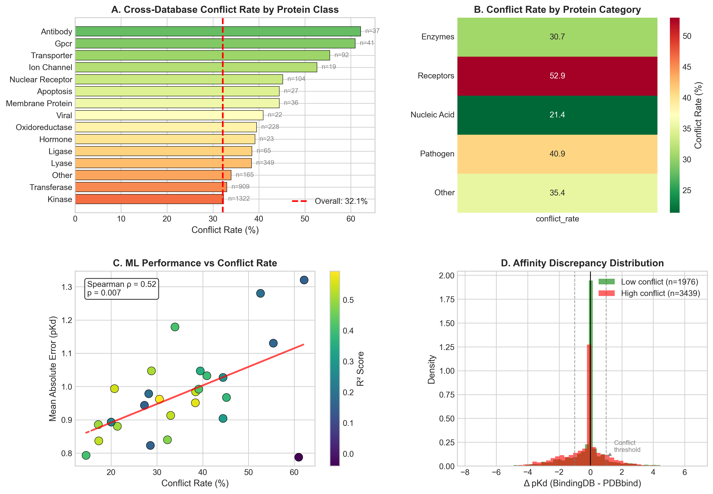
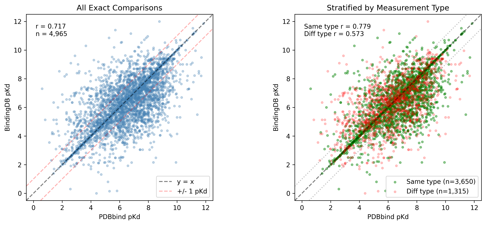
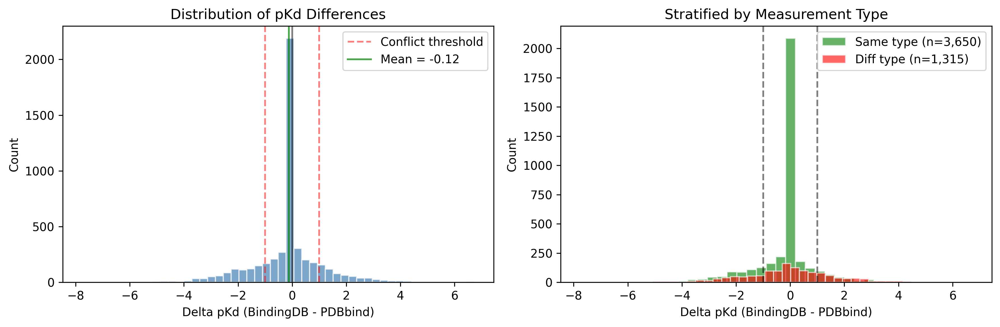
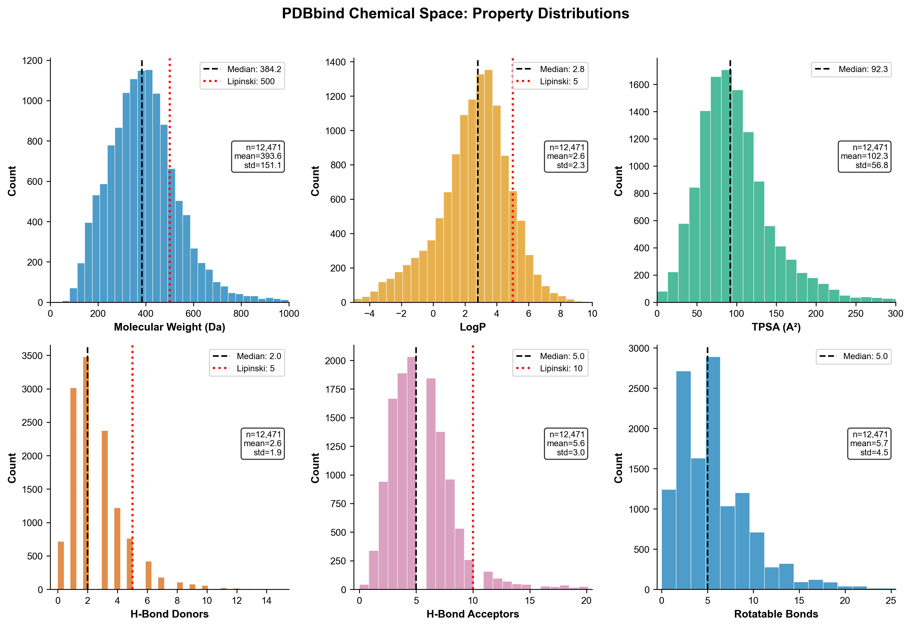
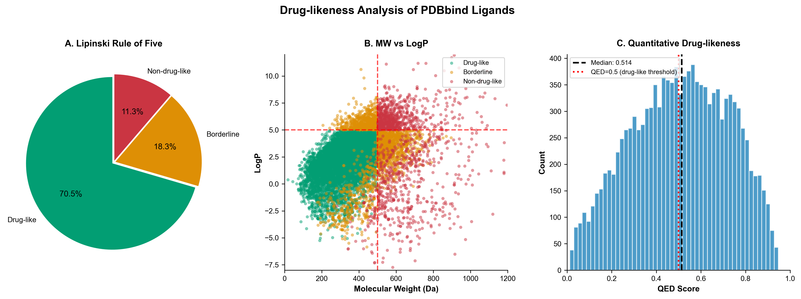
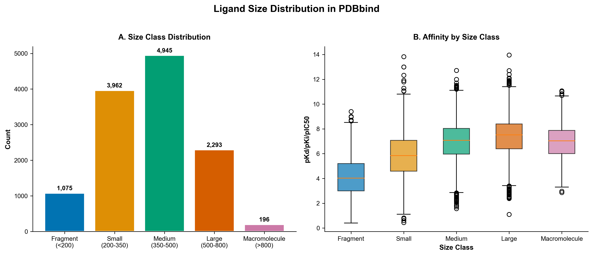
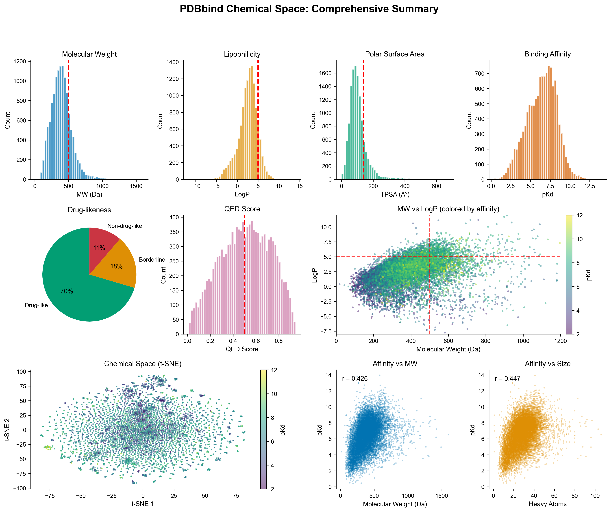

# PDBbind Cross-Database Binding Affinity Conflict Analysis



## Key Finding

**25.7% of type-matched cross-database comparisons show conflicts** (>10-fold difference in reported binding affinity), revealing significant data quality issues that impact machine learning model training.

## Overview

This repository contains code, data, and pre-trained models for analyzing conflicts in binding affinity values between major structural biology databases: **PDBbind**, **BindingDB**, and **ChEMBL**.

## Quick Start

```bash
# Install dependencies
pip install -r requirements.txt

# Run the full analysis pipeline
python src/01_run_full_pipeline.py

# Or use the interactive prediction notebook
jupyter notebook notebooks/predict_binding_affinity.ipynb
```

## Repository Structure

```
publication/
├── src/                    # Analysis scripts
│   ├── 01_run_full_pipeline.py  # Complete data collection and analysis
│   └── 02_train_and_save_models.py  # Train and export ML models
├── data/
│   ├── raw/               # Source data files
│   │   ├── pdbbind_with_smiles.tsv
│   │   ├── bindingdb_matched_pdbbind.tsv
│   │   └── chembl_matched_pdbbind.tsv
│   ├── comparisons/       # Cross-database comparison results
│   │   ├── pdbbind_vs_bindingdb_type_matched.tsv
│   │   └── conflict_rates_by_type.tsv
│   ├── case_studies/      # Extreme conflict case studies
│   └── ml_results/        # Machine learning evaluation results
├── models/                 # Pre-trained ML models
│   ├── xgboost_model.pkl   # Best model (R² = 0.50)
│   ├── random_forest_model.pkl
│   ├── lightgbm_model.pkl
│   └── model_summary.json
├── notebooks/             # Interactive Jupyter notebooks
│   └── predict_binding_affinity.ipynb  # Predict your own compounds
├── figures/               # Publication figures
└── requirements.txt
```

## Key Results

### Conflict Rate Analysis

| Comparison Type | N Pairs | Conflicts | Rate |
|----------------|---------|-----------|------|
| All comparisons | 5,438 | 1,747 | 32.1% |
| Type-matched (valid) | 3,910 | 1,004 | **25.7%** |
| Type-mismatched | 1,528 | 743 | 48.6% |

**Important**: The "type-matched" rate is the scientifically valid conflict rate. Comparing IC50 to Ki/Kd values is methodologically incorrect and inflates apparent conflicts.

### Why Measurement Type Matters

- **Ki/Kd**: Thermodynamic equilibrium constants (intrinsic properties)
- **IC50**: Functional measurement dependent on assay conditions

The Cheng-Prusoff equation shows IC50 can be 2-10x higher than Ki depending on substrate concentration.

### Conflict Rates by Measurement Type

| PDBbind Type | BindingDB Type | Match? | Conflict Rate |
|--------------|----------------|--------|---------------|
| Ki | Ki | SAME | 27.4% |
| Kd | Kd | SAME | 25.7% |
| IC50 | IC50 | SAME | 24.9% |
| Ki | IC50 | DIFF | 51.9% |
| Kd | IC50 | DIFF | 54.7% |

## Figures

### Main Figures

| Figure | Description |
|--------|-------------|
|  | **Figure 1.** Cross-database conflict overview by protein class |
|  | **Figure 2.** PDBbind vs BindingDB value correlation |
|  | **Figure 3.** Distribution of pKd differences |
|  | **Figure 4.** Conflict rates by measurement type |

### Supplementary Figures

| Figure | Description |
|--------|-------------|
|  | **Figure S1.** Molecular property distributions across PDBbind |
|  | **Figure S2.** Drug-likeness analysis (Lipinski's Rule of 5) |
|  | **Figure S3.** Binding affinity vs molecular properties |
|  | **Figure S4.** t-SNE visualization of chemical space |
|  | **Figure S5.** Ligand size distribution in PDBbind |
|  | **Figure S6.** Complete analysis summary dashboard |

## Pre-trained Models

We provide three pre-trained models for binding affinity prediction (5-fold cross-validation metrics):

| Model | CV R² | RMSE | MAE | File Size |
|-------|-------|------|-----|-----------|
| XGBoost | 0.52 | 1.30 | 1.00 | 384 KB |
| LightGBM | 0.50 | 1.33 | 1.04 | 278 KB |
| Random Forest | 0.48 | 1.36 | 1.06 | 4.7 MB |

### Using Pre-trained Models

```python
import pickle
from rdkit import Chem
from rdkit.Chem import Descriptors

# Load model
with open('models/xgboost_model.pkl', 'rb') as f:
    model_data = pickle.load(f)

model = model_data['model']
feature_cols = model_data['feature_cols']

# Calculate descriptors for your molecule
smiles = "CC(C)CC1=CC=C(C=C1)C(C)C(=O)O"  # Ibuprofen
mol = Chem.MolFromSmiles(smiles)
features = [
    Descriptors.MolWt(mol),
    Descriptors.MolLogP(mol),
    Descriptors.TPSA(mol),
    # ... (see notebook for full list)
]

# Predict
predicted_pKd = model.predict([features])[0]
print(f"Predicted pKd: {predicted_pKd:.2f}")
```

## Recommendations for ML Practitioners

1. **Always filter for matching measurement types** before training models
2. **Use Kd/Ki values preferentially** - they are thermodynamic constants
3. **Cross-validate extreme values** (>1000-fold difference) before training
4. **Report measurement type distribution** in training data documentation

## Data Sources

- **PDBbind**: http://www.pdbbind.org.cn/ (v2020)
- **BindingDB**: https://www.bindingdb.org/ (REST API)
- **ChEMBL**: https://www.ebi.ac.uk/chembl/

## License

This code is released under the MIT License. Data from PDBbind, BindingDB, and ChEMBL are subject to their respective licenses.

## Contact

For questions or issues, please open a GitHub issue.
